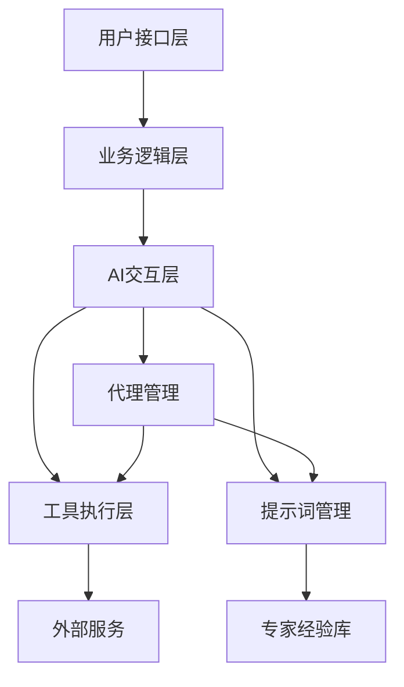

# AI智能课件生成器设计文档

## 1. 系统架构

### 1.1 核心组件



### 1.2 分层设计

- **用户接口层**：处理用户输入，展示生成结果
- **业务逻辑层**：处理课程生成、质量评估等核心业务逻辑
- **AI交互层**：抽象AI交互模式，管理提示词和工具
- **工具执行层**：执行各种工具操作，如生成SVG、验证HTML等
- **外部服务**：调用外部API，如搜索服务、代码生成服务等
- **专家经验库**：存储和管理教学经验，支持持续迭代

## 2. 核心组件伪代码

### 2.1 提示词管理系统

```typescript
// 提示词配置接口
interface PromptConfig {
  id: string;           // 提示词ID
  name: string;         // 提示词名称
  version: string;      // 版本号
  systemPrompt: string; // 系统提示词
  userPromptTemplate: string; // 用户提示词模板
  description: string;  // 描述
  tags: string[];       // 标签
  createdAt: string;    // 创建时间
  updatedAt: string;    // 更新时间
  author: string;       // 作者
}

// 提示词管理器
class PromptManager {
  private prompts: Map<string, Map<string, PromptConfig>>; // id -> version -> config
  private defaultPromptId: string;

  // 注册提示词
  registerPrompt(config: PromptConfig) {
    // 将提示词按ID和版本存储
  }

  // 获取提示词
  getPrompt(id: string, version?: string): PromptConfig | null {
    // 根据ID和版本获取提示词
  }

  // 生成提示词
  generatePrompt(id: string, params: Record<string, any>): string {
    // 加载提示词配置
    // 替换模板参数
    // 返回完整提示词
  }

  // 设置默认提示词
  setDefaultPrompt(id: string) {
    // 设置默认提示词ID
  }

  // 获取默认提示词
  getDefaultPrompt(): PromptConfig | null {
    // 返回默认提示词
  }

  // 获取所有提示词
  getAllPrompts(): PromptConfig[] {
    // 返回所有提示词
  }
}
```

### 2.2 工具管理系统

```typescript
// 工具定义接口
interface ToolDefinition {
  name: string;         // 工具名称
  description: string;  // 工具描述
  inputSchema: any;     // 输入 schema
}

// 工具配置接口
interface ToolConfig {
  id: string;           // 工具ID
  name: string;         // 工具名称
  version: string;      // 版本号
  tool: ToolDefinition; // 工具定义
  description: string;  // 描述
  tags: string[];       // 标签
  createdAt: string;    // 创建时间
  updatedAt: string;    // 更新时间
  author: string;       // 作者
}

// 工具管理器
class ToolManager {
  private tools: Map<string, Map<string, ToolConfig>>; // id -> version -> config
  private toolHandlers: Map<string, (params: any) => Promise<any>>; // 工具名称 -> 处理器

  // 注册工具
  registerTool(config: ToolConfig) {
    // 将工具按ID和版本存储
  }

  // 获取工具
  getTool(id: string, version?: string): ToolConfig | null {
    // 根据ID和版本获取工具
  }

  // 注册工具处理器
  registerToolHandler(toolName: string, handler: (params: any) => Promise<any>) {
    // 注册工具处理器
  }

  // 执行工具
  async executeTool(toolName: string, params: any): Promise<any> {
    // 获取工具处理器
    // 执行工具
    // 返回执行结果
  }

  // 获取工具定义列表
  getToolDefinitions(toolIds: string[]): any[] {
    // 获取工具定义
    // 转换为OpenCodeTool格式
  }

  // 获取所有工具
  getAllTools(): ToolConfig[] {
    // 返回所有工具
  }
}
```

### 2.3 代理管理系统

```typescript
// 代理配置接口
interface AgentConfig {
  id: string;           // 代理ID
  name: string;         // 代理名称
  promptId: string;     // 提示词ID
  toolIds: string[];    // 工具ID列表
  description: string;  // 描述
  tags: string[];       // 标签
  createdAt: string;    // 创建时间
  updatedAt: string;    // 更新时间
  author: string;       // 作者
}

// 代理选项接口
interface AgentOptions {
  maxRetries?: number;  // 最大重试次数
  timeoutMs?: number;   // 超时时间
}

// 代理结果接口
interface AgentResult {
  success: boolean;     // 是否成功
  output: string;       // 输出内容
  metadata?: any;       // 元数据
  error?: string;       // 错误信息
}

// AI代理类
class AIAgent {
  private config: AgentConfig;
  private client: OpenCodeClient;

  constructor(config: AgentConfig, client: OpenCodeClient) {
    this.config = config;
    this.client = client;
  }

  // 执行代理
  async execute(params: Record<string, any>, options: AgentOptions = {}): Promise<AgentResult> {
    // 生成提示词
    // 获取工具定义
    // 调用AI模型
    // 处理工具调用
    // 返回结果
  }
}

// 代理工厂
class AgentFactory {
  private agents: Map<string, AgentConfig>; // id -> config
  private client: OpenCodeClient;

  constructor(client: OpenCodeClient) {
    this.client = client;
  }

  // 注册代理
  registerAgent(config: AgentConfig) {
    // 注册代理配置
  }

  // 获取代理
  getAgent(id: string): AgentConfig | null {
    // 获取代理配置
  }

  // 创建代理实例
  createAgent(id: string): AIAgent | null {
    // 获取代理配置
    // 创建代理实例
  }

  // 加载代理
  loadAgents(agents: AgentConfig[]) {
    // 批量注册代理
  }
}
```

### 2.4 工具适配器

```typescript
// 工具适配器
class ToolAdapter {
  private legacyToolManager: LegacyToolManager;

  constructor(legacyToolManager: LegacyToolManager) {
    this.legacyToolManager = legacyToolManager;
  }

  // 初始化工具适配器
  init() {
    // 注册核心工具处理器
    // 注册文件工具处理器
  }

  // 注册核心工具处理器
  registerCoreToolHandlers() {
    // 注册生成SVG工具
    // 注册生成HTML组件工具
    // 注册验证HTML工具
    // 注册搜索教育内容工具
    // 注册保存课程HTML工具
  }

  // 注册文件工具处理器
  registerFileToolHandlers() {
    // 注册创建文件工具
    // 注册写入文件工具
    // 注册读取文件工具
    // 注册列出文件工具
    // 注册文件存在检查工具
    // 注册创建目录工具
    // 注册删除文件工具
    // 注册复制文件工具
    // 注册保存文件工具
    // 注册分割文件工具
    // 注册合并文件工具
  }
}
```

### 2.5 课程代理

```typescript
// 生成选项接口
interface GenerationOptions {
  maxRetries: number;          // 最大重试次数
  retryDelayMs: number;        // 重试延迟
  enableWebSearch: boolean;    // 是否启用网络搜索
  enableLocalSearch: boolean;  // 是否启用本地搜索
  enableValidation: boolean;   // 是否启用验证
  enableQualityRefinement: boolean; // 是否启用质量优化
  maxRefinementAttempts: number; // 最大优化尝试次数
  qualityThreshold: QualityThreshold; // 质量阈值
}

// 生成结果接口
interface GenerationResult {
  success: boolean;       // 是否成功
  html: string;           // 生成的HTML
  courseId?: string;      // 课程ID
  validation?: ValidationResult; // 验证结果
  qualityScore?: QualityScore; // 质量评分
  attempts: number;       // 尝试次数
  duration: number;       // 持续时间
  error?: GenerationError; // 错误信息
}

// 课程代理类
class CourseAgent {
  private client: OpenCodeClient;
  private validator: HtmlValidator;
  private codeValidator: CodeValidator;
  private webSearch: WebSearchService;
  private localSearch: LocalKnowledgeSearch;
  private refinementLoop: RefinementLoop;
  private options: GenerationOptions;

  constructor(options: Partial<GenerationOptions> = {}) {
    // 初始化AI系统
    // 初始化依赖服务
    // 设置选项
  }

  // 生成课程
  async generate(prompt: string, onProgress?: ProgressCallback, courseId?: string): Promise<GenerationResult> {
    // 搜索相关资料
    // 使用提示词管理系统生成提示词
    // 调用AI模型
    // 解析和验证结果
    // 返回生成结果
  }

  // 生成并优化课程
  async generateWithRefinement(prompt: string, onProgress?: ProgressCallback, courseId?: string): Promise<GenerationResult> {
    // 使用提示词管理系统生成提示词
    // 执行多轮优化
    // 返回优化后的结果
  }

  // 提取主题
  private extractTopic(prompt: string): string {
    // 从提示词中提取主题
  }

  // 丰富提示词
  private enrichPromptWithSearch(prompt: string, searchResults: SearchResult[]): string {
    // 使用搜索结果丰富提示词
  }

  // 处理错误
  private enrichPromptWithError(prompt: string, error: GenerationError, validationErrors: ValidationError[]): string {
    // 根据错误信息丰富提示词
  }

  // 分类错误
  private classifyError(error: any): GenerationError {
    // 分类错误类型
  }

  // 生成课程ID
  private generateCourseId(prompt: string): string {
    // 生成唯一课程ID
  }

  // 报告进度
  private reportProgress(progress: GenerationProgress) {
    // 报告生成进度
  }

  // 延迟
  private delay(ms: number): Promise<void> {
    // 延迟执行
  }

  // 获取提示词预览
  private getPromptPreview(prompt: string): string {
    // 获取提示词预览
  }
}
```

## 3. 系统初始化流程

```typescript
// 初始化AI系统
function initAISystem() {
  // 加载默认提示词
  promptManager.loadPrompts(DEFAULT_PROMPTS);
  
  // 加载默认工具
  toolManager.loadTools(DEFAULT_TOOLS);
  
  // 加载默认代理
  agentFactory.loadAgents(DEFAULT_AGENTS);
  
  // 初始化工具适配器
  toolAdapter.init();
  
  // 设置默认提示词
  promptManager.setDefaultPrompt('course-generation');
  
  console.log('AI system initialized successfully');
}

// 重新加载AI系统配置
function reloadAISystem() {
  // 清空现有配置
  // 重新加载默认配置
  // 初始化工具适配器
  console.log('AI system reloaded successfully');
}
```

## 4. 默认配置

### 4.1 默认提示词

```typescript
const DEFAULT_PROMPTS: PromptConfig[] = [
  {
    id: 'course-generation',
    name: '课程生成',
    version: '1.0.0',
    systemPrompt: '你是一位经验丰富的教师，擅长根据教学目标和学生特点设计高质量的课件。',
    userPromptTemplate: '请为{{subject}}学科，{{grade_text}}年级，难度{{difficulty_text}}的学生，设计一个时长{{duration_minutes}}分钟的课件，主题是：{{user_question}}。',
    description: '用于生成课程课件的提示词',
    tags: ['课程生成', '教学'],
    createdAt: new Date().toISOString(),
    updatedAt: new Date().toISOString(),
    author: 'system'
  },
  {
    id: 'course-refinement',
    name: '课程优化',
    version: '1.0.0',
    systemPrompt: '你是一位教育专家，擅长评估和优化教学内容。',
    userPromptTemplate: '请评估并优化以下课程内容，使其更符合{{subject}}学科，{{grade_text}}年级学生的学习需求：\n\n{{content}}',
    description: '用于优化课程内容的提示词',
    tags: ['课程优化', '教学评估'],
    createdAt: new Date().toISOString(),
    updatedAt: new Date().toISOString(),
    author: 'system'
  }
];
```

### 4.2 默认工具

```typescript
const DEFAULT_TOOLS: ToolConfig[] = [
  {
    id: 'generate-svg',
    name: '生成SVG',
    version: '1.0.0',
    tool: {
      name: 'generate_svg',
      description: '生成SVG图形',
      inputSchema: {
        type: 'object',
        properties: {
          description: {
            type: 'string',
            description: 'SVG图形描述'
          }
        },
        required: ['description']
      }
    },
    description: '生成SVG图形工具',
    tags: ['SVG', '图形生成'],
    createdAt: new Date().toISOString(),
    updatedAt: new Date().toISOString(),
    author: 'system'
  },
  {
    id: 'generate-html-component',
    name: '生成HTML组件',
    version: '1.0.0',
    tool: {
      name: 'generate_html_component',
      description: '生成HTML组件',
      inputSchema: {
        type: 'object',
        properties: {
          description: {
            type: 'string',
            description: 'HTML组件描述'
          }
        },
        required: ['description']
      }
    },
    description: '生成HTML组件工具',
    tags: ['HTML', '组件生成'],
    createdAt: new Date().toISOString(),
    updatedAt: new Date().toISOString(),
    author: 'system'
  },
  {
    id: 'validate-html',
    name: '验证HTML',
    version: '1.0.0',
    tool: {
      name: 'validate_html',
      description: '验证HTML有效性',
      inputSchema: {
        type: 'object',
        properties: {
          html: {
            type: 'string',
            description: '要验证的HTML'
          }
        },
        required: ['html']
      }
    },
    description: '验证HTML有效性工具',
    tags: ['HTML', '验证'],
    createdAt: new Date().toISOString(),
    updatedAt: new Date().toISOString(),
    author: 'system'
  },
  {
    id: 'search-educational-content',
    name: '搜索教育内容',
    version: '1.0.0',
    tool: {
      name: 'search_educational_content',
      description: '搜索教育相关内容',
      inputSchema: {
        type: 'object',
        properties: {
          query: {
            type: 'string',
            description: '搜索查询'
          }
        },
        required: ['query']
      }
    },
    description: '搜索教育内容工具',
    tags: ['搜索', '教育内容'],
    createdAt: new Date().toISOString(),
    updatedAt: new Date().toISOString(),
    author: 'system'
  },
  {
    id: 'save-course-html',
    name: '保存课程HTML',
    version: '1.0.0',
    tool: {
      name: 'save_course_html',
      description: '保存课程HTML到文件',
      inputSchema: {
        type: 'object',
        properties: {
          html: {
            type: 'string',
            description: '课程HTML内容'
          },
          filename: {
            type: 'string',
            description: '文件名'
          }
        },
        required: ['html', 'filename']
      }
    },
    description: '保存课程HTML工具',
    tags: ['文件操作', '课程保存'],
    createdAt: new Date().toISOString(),
    updatedAt: new Date().toISOString(),
    author: 'system'
  }
];
```

### 4.3 默认代理

```typescript
const DEFAULT_AGENTS: AgentConfig[] = [
  {
    id: 'course-generator',
    name: '课程生成代理',
    promptId: 'course-generation',
    toolIds: ['generate-svg', 'generate-html-component', 'validate-html', 'search-educational-content', 'save-course-html'],
    description: '用于生成课程课件的代理',
    tags: ['课程生成', '教学'],
    createdAt: new Date().toISOString(),
    updatedAt: new Date().toISOString(),
    author: 'system'
  },
  {
    id: 'course-reviewer',
    name: '课程评审代理',
    promptId: 'course-refinement',
    toolIds: ['validate-html', 'search-educational-content'],
    description: '用于评审和优化课程内容的代理',
    tags: ['课程评审', '教学评估'],
    createdAt: new Date().toISOString(),
    updatedAt: new Date().toISOString(),
    author: 'system'
  }
];
```

## 5. 可扩展性设计

### 5.1 提示词扩展

```typescript
// 示例：添加新的学科提示词
const physicsPrompt: PromptConfig = {
  id: 'physics-course',
  name: '物理课程生成',
  version: '1.0.0',
  systemPrompt: '你是资深的物理教师，擅长讲解物理概念和实验',
  userPromptTemplate: '请为{{grade_text}}年级学生设计一个关于{{topic}}的物理课件，包含实验演示和概念讲解。',
  description: '用于生成物理课程的提示词',
  tags: ['物理', '课程生成'],
  createdAt: new Date().toISOString(),
  updatedAt: new Date().toISOString(),
  author: 'physics-expert'
};

// 注册新提示词
promptManager.registerPrompt(physicsPrompt);
```

### 5.2 工具扩展

```typescript
// 示例：添加新的工具
const mathTool: ToolConfig = {
  id: 'solve-math-problem',
  name: '解决数学问题',
  version: '1.0.0',
  tool: {
    name: 'solve_math_problem',
    description: '解决数学问题',
    inputSchema: {
      type: 'object',
      properties: {
        problem: {
          type: 'string',
          description: '数学问题描述'
        }
      },
      required: ['problem']
    }
  },
  description: '解决数学问题的工具',
  tags: ['数学', '问题解决'],
  createdAt: new Date().toISOString(),
  updatedAt: new Date().toISOString(),
  author: 'math-expert'
};

// 注册新工具
toolManager.registerTool(mathTool);

// 注册工具处理器
toolManager.registerToolHandler('solve_math_problem', async (params: any) => {
  // 实现数学问题解决逻辑
  return { result: '解决结果' };
});
```

### 5.3 代理扩展

```typescript
// 示例：创建新的代理
const mathAgent: AgentConfig = {
  id: 'math-generator',
  name: '数学课件生成代理',
  promptId: 'math-course',
  toolIds: ['solve-math-problem', 'generate-svg', 'validate-html'],
  description: '用于生成数学课件的代理',
  tags: ['数学', '课程生成'],
  createdAt: new Date().toISOString(),
  updatedAt: new Date().toISOString(),
  author: 'math-expert'
};

// 注册新代理
agentFactory.registerAgent(mathAgent);
```

## 6. 测试用例

### 6.1 提示词管理测试

```typescript
describe('PromptManager', () => {
  test('should register and retrieve prompts', () => {
    // 注册测试提示词
    // 获取提示词
    // 验证提示词属性
  });

  test('should generate prompt with parameters', () => {
    // 生成带参数的提示词
    // 验证参数替换
  });

  test('should handle versioning', () => {
    // 注册不同版本的提示词
    // 获取最新版本
    // 获取特定版本
  });
});
```

### 6.2 工具管理测试

```typescript
describe('ToolManager', () => {
  test('should register and retrieve tools', () => {
    // 注册测试工具
    // 获取工具
    // 验证工具属性
  });

  test('should register and execute tool handlers', async () => {
    // 注册测试工具处理器
    // 执行工具
    // 验证执行结果
  });

  test('should handle tool definitions', () => {
    // 获取工具定义
    // 验证工具定义格式
  });
});
```

### 6.3 代理工厂测试

```typescript
describe('AgentFactory', () => {
  test('should register and retrieve agents', () => {
    // 注册测试代理
    // 获取代理
    // 验证代理属性
  });

  test('should create agent instances', () => {
    // 创建代理实例
    // 验证实例创建
  });
});
```

### 6.4 架构可扩展性测试

```typescript
describe('Architecture Extensibility', () => {
  test('should support adding new prompts without code changes', () => {
    // 注册新提示词
    // 验证新提示词可用
  });

  test('should support adding new tools without code changes', () => {
    // 注册新工具
    // 注册工具处理器
    // 验证新工具可用
  });

  test('should support creating new agents without code changes', () => {
    // 注册新代理
    // 验证新代理可用
  });
});
```

## 7. 总结

AI智能课件生成器采用了模块化、可扩展的架构设计，主要特点包括：

1. **分层设计**：清晰的分层架构，将用户接口、业务逻辑、AI交互、工具执行等分离，提高了系统的可维护性和可扩展性。

2. **提示词管理**：支持提示词的版本控制和模板化生成，使得教学经验可以持续迭代和完善。

3. **工具管理**：支持工具的动态注册和执行，通过工具适配器集成现有工具实现，同时为未来扩展预留了空间。

4. **代理管理**：基于配置创建不同类型的AI代理，集成提示词和工具，实现完整的AI交互流程。

5. **可扩展性**：通过配置驱动的设计，使得系统可以在不修改核心代码的情况下添加新的提示词、工具和代理，支持教学经验的持续迭代。

6. **类型安全**：使用TypeScript的类型系统，确保系统的类型安全和代码质量。

7. **测试覆盖**：通过全面的测试用例，验证系统的功能和可扩展性，确保系统的可靠性。

这种设计使得教学专家可以专注于优化提示词和工具配置，不断提升AI生成课件的质量，同时保持系统的稳定性和可维护性。